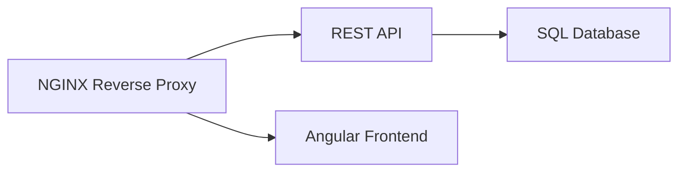

# Singing City

Singing City is a Proof-of-Concept web application that connects artists and venues for performances.
It works by 

- inviting Artists and Venues to join the app 
- venues publishing available timeslots for performances
- artists applying for timeslots
- venues accepting or declining applications

## 🚨 Attention 🚨

`v1.x.x` are PoC versions.
The application is currently undergoing major rewrites and can not be considered stable at this point.

## Architecture

