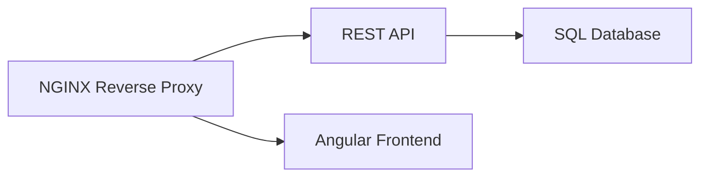

# Singing City

Singing City is a web application that connects artists and venues.
Venues can publish available timeslots and artists apply for those.

## Architecture

```mermaid
flowchart LR
    nginx[NGINX Reverse Proxy] --> backend[REST API];
    nginx --> frontend[Angular Frontend];
    backend --> db[SQL Database];
```