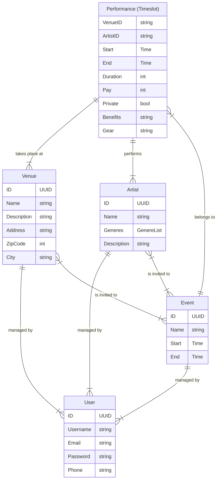

# Datamodel

v2 introduces the type of an `Event`.

```mermaid
erDiagram
    User {
        ID UUID
        Username string
        Email string
        Password string
        Phone string
    }
    Event {
        ID UUID
        Name string
        Start Time
        End Time
    }
    Artist {
        ID UUID
        Name string
        Generes GenereList
        Description string
    }
    Venue {
        ID UUID
        Name string
        Description string
        Address string
        ZipCode int
        City string
    }
    Performance["Performance (Timeslot)"] {
        VenueID string
        ArtistID string
        Start Time
        End Time
        Duration int
        Pay int
        Private bool
        Benefits string
        Gear string
    }
    Venue  ||--|{ User : "managed by"
    Artist ||--|{ User : "managed by"
    Performance ||--|{ Venue : "takes place at"
    Performance ||--|{ Artist : "performs"
    Performance }|--|| Event : "belongs to"
    Event ||--|{ User : "managed by"
    Artist }|--|{ Event :  "is invited to"
    Venue }|--|{ Event :  "is invited to"
```